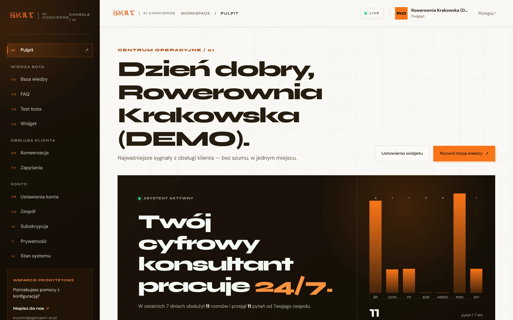
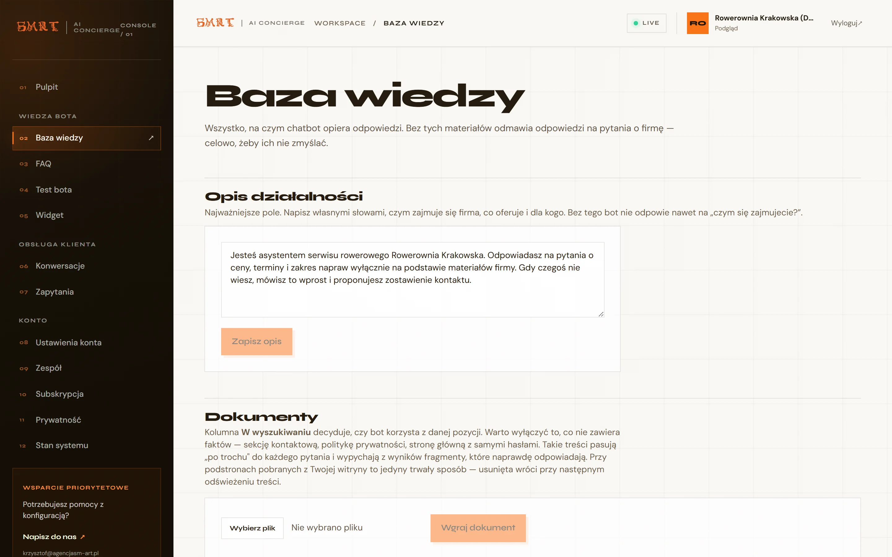
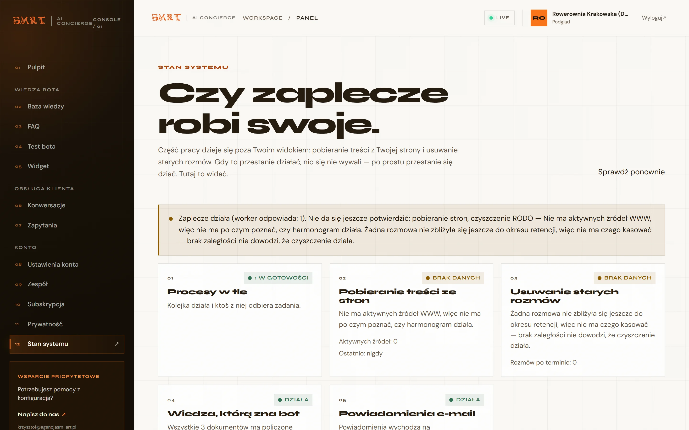
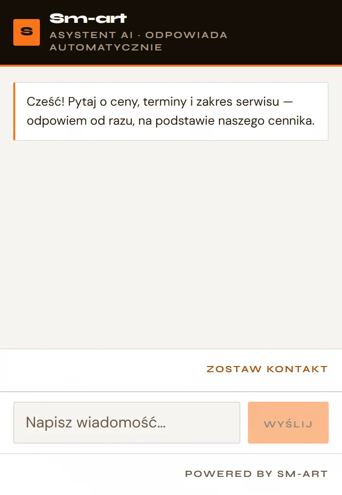
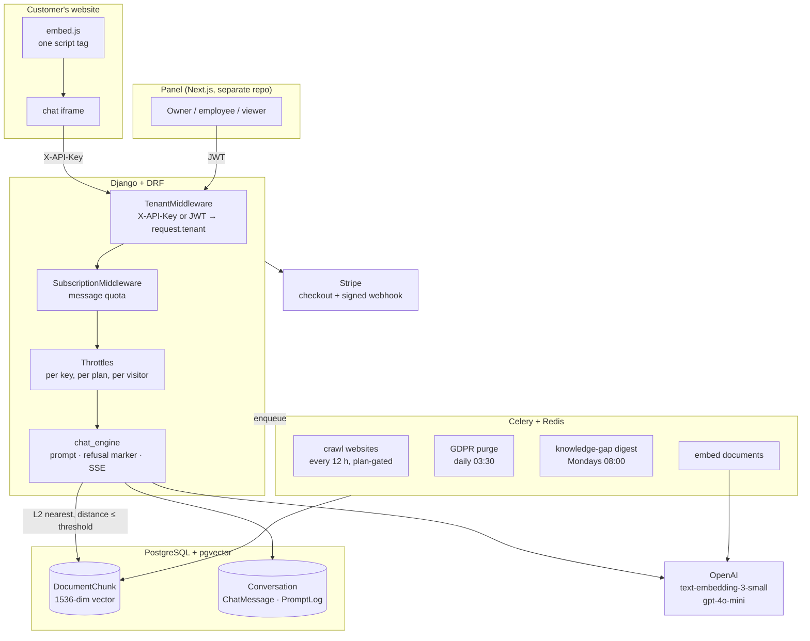

# SM-art Chat — backend

Multi-tenant RAG chatbot that answers website visitors' questions from a company's own
documents, and refuses to answer when those documents don't cover the question.

[](https://github.com/piatekkrzysztof/chatbot_project/actions/workflows/ci.yml)


> **Language note.** This README is English. Code comments, commit messages and the
> product UI are Polish — the product serves Polish small businesses and the comments
> are written for whoever maintains it. If you're reviewing this repository and would
> rather read the reasoning in English, [open an issue](https://github.com/piatekkrzysztof/chatbot_project/issues)
> and I'll translate the module you care about.

---

## What it does

A small business embeds one `<script>` tag on their site. Visitors ask questions in a
chat bubble; the bot answers from that company's own pricing pages, service descriptions
and FAQs. When the knowledge base doesn't cover a question, the bot says so and offers to
take a contact detail instead of inventing an answer — the owner gets an e-mail and a
weekly digest of everything the bot couldn't answer.

The refusal is the point. A chatbot that confidently invents opening hours is worse than
no chatbot, because the business only finds out when a customer shows up at a closed door.



| | |
|---|---|
|  |  |
| Every document the bot may quote, with a per-document search toggle | Background jobs, mail and knowledge health — the parts that fail silently |

<p>
  
  
</p>

<sub>Left: the widget at the size it actually renders in — 360×520, the frame
<code>embed.js</code> injects. Right: the panel on a phone.</sub>

---

## Live demo

| What | Where | Credentials |
|---|---|---|
| **Widget, in production** | [agencjasm-art.pl](https://agencjasm-art.pl) — bubble in the corner | none, it's public |
| **API** | `https://api.agencjasm-art.pl/api/billing/cennik/` | none, public pricing endpoint |
| **Panel** | [panel.agencjasm-art.pl](https://panel.agencjasm-art.pl) | `demo@agencjasm-art.pl` / `demo` |

The demo account has the `viewer` role: it can read every screen, and write nothing.
Uploading a document, editing the widget or deleting an FAQ all return `403` and the
panel greys those controls out. The demo tenant is isolated from real customers by the
same tenant scoping the product uses; see [Security model](#security-model).

Its data is generated by `manage.py zasiej_demo` from a fixed random seed, so the
screenshots above and what you see after logging in are the same thing.

---

## Architecture



**Request path for one visitor question:** middleware resolves the tenant from the API
key and checks the quota → the question is embedded → pgvector returns the nearest
chunks *within a distance threshold* → those chunks plus the tenant's business
description become the system prompt → the model answers, or emits a refusal marker that
the streaming layer strips before the first token reaches the browser.

---

## Key technical decisions

**pgvector, not a separate vector database.** The project used to dual-write to ChromaDB
and Postgres. Chroma's client was instantiated per task, so its writes vanished between
requests — the retrieval that actually worked was always the Postgres one. Removing it
deleted `onnxruntime`, `kubernetes`, `grpcio` and all of OpenTelemetry from the image:
hundreds of megabytes that nothing imported. One database also means tenant isolation is
enforced by the same `WHERE tenant_id = …` as everything else, instead of by a second
system that has to be kept in sync.

**A distance threshold, not just top-k.** `ORDER BY embedding <-> query LIMIT 5` always
returns five chunks, however unrelated. Without a ceiling on distance there is no
difference between "the five best matches" and "there is no match", so the bot cannot
refuse. `RAG_MAX_DISTANCE` supplies that ceiling; `manage.py zmierz_prog_rag` measures
the right value per tenant by splitting answered from unanswered questions in their own
history, because the value depends on the customer's documents and cannot be guessed.

**The refusal marker sits at the front of the answer, not the end.** The model is told to
prefix `[BRAK_ODPOWIEDZI]` when the context doesn't cover the question. It has to be the
first token: under SSE the answer is already on the visitor's screen by the time a
trailing marker would arrive. `ObcinaczZnacznika` strips it from the stream head, which
also lets the backend log *why* a question failed — that log is what the weekly
knowledge-gap digest is built from.

**A per-document search toggle.** Measured on production: the agency's own "Contact —
let's talk about the right solution" page was the nearest hit for six of eleven sampled
questions, about christenings, shipping containers, the weather and washing machines. It
carries no facts, so it sits *moderately close* to everything and crowds out chunks that
actually answer. No threshold fixes this — such a page is often nearer than the real hit.
The decision is left to a human, because only a human knows whether `/kontakt` is an empty
call-to-action or the page with the opening hours.

**Structure-aware chunking.** Splitting on a fixed character count cuts a price away from
the service it belongs to. `documents/utils/fragmenty.py` splits on headings with an
overlap; the constants (`MAKS_ZNAKOW = 1200`, `ZAKLADKA = 180`,
`MIN_TRESCI_POD_NAGLOWKIEM = 60`) were tuned by measurement, not taste — at 90 the short
pricing sections broke apart, at a higher `MIN_DLUGOSC_FRAGMENTU` neighbouring sections
merged back together.

**Two extraction passes, keep the longer.** `trafilatura` sometimes returns 257 characters
of a 10 037-character page, and the document still looks "processed" in the panel. The
crawler now runs a second, structural pass and keeps whichever yields more visible text,
and records `znakow_na_stronie` so the health page can flag pages that came in thin.

**Direct dependencies only in `requirements.txt`.** It used to be a `pip freeze` dump.
Two of the comments in that file are scar tissue: `lxml_html_clean` is imported by nothing
in this codebase but `trafilatura` needs it, and without it gunicorn cannot import the WSGI
app at all — 231 tests passed while production wouldn't boot, because the package arrived
transitively through a *dev* dependency. CI now has a separate job that installs only
`requirements.txt` and checks that WSGI and Celery import.

**Silent failure is the recurring enemy.** Several decisions exist only to make failures
audible: `CELERY_TASK_EAGER_PROPAGATES` (eager mode swallows task exceptions, so a
crashing task looked identical to a passing one), `fail_silently=False` on notification
mail, a crawl that reports the page count rather than just "done", and a `/stan` page that
reports queue, crawl, purge, knowledge and mail health because all five fail quietly.

---

## Quickstart

Verified end to end on a clean Docker daemon: five services up, migrations applied,
API answering, worker consuming from Redis, demo data seeded.

```bash
git clone https://github.com/piatekkrzysztof/chatbot_project.git
cd chatbot_project
cp .env.example .env          # only OPENAI_API_KEY matters for a first run
docker compose up -d
```

```bash
docker compose exec web python manage.py zasiej_demo
```

That prints a login, a password and a widget key. The API is on
`http://localhost:8000`, the OpenAPI schema on `/api/schema/`.

Without an OpenAI key everything works except the two things that call OpenAI: the bot
answering, and computing embeddings. The demo seed writes random vectors of the correct
dimension on purpose, so retrieval runs mechanically without a key — once you add one,
`manage.py przelicz_fragmenty --wykonaj` recomputes them for real.

Already running Postgres on 5432? `PORT_DB=55432 docker compose up -d`.

<details>
<summary>Without Docker</summary>

Needs Python 3.11, PostgreSQL 16 with the `vector` extension, and Redis.

```bash
python -m venv venv && source venv/bin/activate    # Windows: venv\Scripts\activate
pip install -r requirements-dev.txt
export DJANGO_ENV=dev REDIS_URL=redis://localhost:6379/0
python manage.py migrate
python manage.py zasiej_demo
python manage.py runserver
celery -A chatbot_project worker --loglevel=info   # second terminal
```

With `REDIS_URL` unset, Celery runs tasks inline in the web process — fine for
development, but then nothing scheduled runs.
</details>

To create a real tenant rather than the demo one:

```bash
python manage.py bootstrap_tenant --company "Firma" --email "owner@firma.pl" --plan grow
```

It prints the widget key and a ready-to-paste embed snippet.

For the Django admin at `/admin/`:

```bash
python manage.py createsuperuser
```

Every user in this project belongs to a tenant — that link is what tenant
isolation is built on. A superuser is a platform operator rather than a
customer, so the user manager files them under a tenant named *Administracja
platformy*, created on first use — nothing to pass, nothing to set up. The
account also gets the `owner` role, so the panel and the admin agree on what
it may do.

Without that manager the standard command failed on a NOT NULL constraint,
which reads like a broken database rather than a missing argument.

---

## Tests

```bash
pytest                                   # everything
pytest api/tests/test_rola_viewer.py     # one file
pytest -k stripe                         # by keyword
pytest -q                                # what CI runs
```

Tests never call OpenAI or Stripe; both are mocked. They need a PostgreSQL with pgvector
— `docker compose up -d db` is enough.

### Current results

| | |
|---|---|
| Tests | **810 passing**, 0 failing |
| Runtime | ~3 min on a laptop (measured; CI time not recorded yet) |
| Coverage | not measured yet — see [Known limitations](#known-limitations) |
| Lint / types | not enforced yet — see [Roadmap](#roadmap) |
| CI | Django checks · missing-migration check · full suite · production-dependency boot test |

The suite is behavioural, not unit-shaped: most files are named after a bug or a decision
(`test_wylaczanie_dokumentow`, `test_odswiezanie_stron`, `test_webhook_faktury`) and their
docstrings record the production measurement that motivated them.

Two habits worth knowing if you contribute:

- **Assertions carry a message when the number matters.** `assert wynik["udzial_procent"] == 3`
  is fine; a permission assertion says which endpoint let the wrong role through.
- **New guard rails are verified by breaking the code on purpose.** The viewer-role tests
  were checked by reverting the permission class and confirming the read test fails —
  a test that cannot fail is decoration.

---

## Security model

**Tenancy.** Every request resolves to exactly one tenant before it reaches a view:
`X-API-Key` for widget traffic, a JWT for panel traffic, both handled by
`TenantMiddleware`. Querysets are scoped through `TenantQuerysetMixin` rather than
per-view filtering, so a missing filter is a missing mixin and shows up in review.

**Two-factor authentication.** Optional, TOTP, enabled by the user. The algorithm is
implemented here rather than pulled from a package - RFC 6238 is HMAC-SHA1 from the
standard library plus a truncation, fully specified and published *with official test
vectors*, so correctness can be proven instead of assumed. All six vectors from Appendix B
are in the test suite. The tension with "don't roll your own crypto" is real and the
reasoning is written down in `accounts/totp.py`.

Setup is two-step: the secret exists after starting, but nothing is enforced until a code
is typed back. Otherwise anyone who scans the QR and closes the tab locks themselves out.
A used code stops working immediately rather than lasting out its 30-second window, and
backup codes are stored as hashes - a readable list in the database would defeat the whole
mechanism for every account at once. Disabling requires the password *and* a code: a
hijacked session has neither.

Not mandatory for owners. Making it mandatory needs a recovery procedure that is more than
"we turn it off over the phone if you sound convincing", and that promise is worse than no
second factor at all.

**Audit log.** Every state-changing request to the API is recorded: who, what, when,
from which address, and how it ended. Written by middleware rather than by calls inside
each view - a call is something you forget to add when you write the next endpoint, and
then the log is full, looks complete, and is missing exactly the entry you need. The
owner of a company reads their own log through `/api/accounts/dziennik/`; there is no
endpoint that writes to it or deletes from it, for them or for us, because a record that
can be corrected afterwards proves nothing.

Request bodies are deliberately not stored. They carry passwords, visitors' personal
data and whole documents; keeping them would turn the audit log into a second, less
guarded copy of everything. `DELETE /api/faq/12/ 204` already says who removed which
entry.

**Login rate limiting.** Two layers, because each catches something the other misses:
10 attempts per minute per IP address, and 5 per minute per account regardless of where
they come from. The second layer is the one that matters - distributing guesses across
addresses is cheap, and an IP-only limit does not notice it. Until 27 August 2026 there
was no limit at all: the project's default throttles key off `request.tenant`, which the
login endpoint does not have, so they returned no cache key and silently did nothing.

**Panel sessions.** Login returns a short-lived access token in the body and sets the
refresh token as an `HttpOnly` `Secure` `SameSite=Lax` cookie scoped to
`/api/accounts/`, so no script can read it and it is not attached to every other API
call. Access tokens last 15 minutes; refresh tokens rotate on every use and the previous
one is blacklisted, so a stolen token logs its owner out rather than granting quiet
access. `POST /api/accounts/logout/` blacklists the token server-side — clearing the
cookie alone would leave a working session behind for two weeks. Covered by
`api/tests/test_uwierzytelnianie_ciasteczkiem.py`, which asserts both halves: that the
right path works *and* that the wrong one is closed.

The panel and the API are subdomains of one registrable domain, which makes requests
between them same-site — that is why `SameSite=Lax` suffices and no BFF layer is needed.

**Roles.** `owner` (billing, team, everything), `employee` (content and settings),
`viewer` (reads every screen, writes nothing, and cannot bulk-export conversations —
paging through the panel and dumping the whole history in one request are different risk
profiles). Enforced by permission classes, covered by `api/tests/test_rola_viewer.py`,
which asserts both halves: that reads are allowed *and* that writes are refused.

**Widget origin allowlist.** A leaked API key is visible in the page source by design.
`WidgetDomain` restricts which origins may use it, so a stolen key cannot be pointed at
someone else's site to burn the victim's message quota.

**Rate limits.** Three layers: per API key, per subscription plan, and per visitor
(`LIMIT_ODWIEDZAJACEGO`, 20/hour by default). The visitor limit needs `TRUSTED_PROXY_DEPTH`
to match the real number of proxies — set it wrong and every visitor looks like one IP.
`/api/diagnostyka/adres/` shows what the server actually sees.

**Payments.** Stripe webhooks are verified with `stripe.Webhook.construct_event` against
`STRIPE_WEBHOOK_SECRET`; without a valid signature anyone could grant themselves any plan.
`@csrf_exempt` must sit directly above the webhook view — a refactor once moved it onto a
helper and every Stripe POST started returning 403. Two tests now pin that, and they were
verified by deliberately reintroducing the bug.

**Production hardening** (`settings/prod.py`): HSTS one year with preload and subdomains,
SSL redirect, `Secure` session and CSRF cookies, `X-Frame-Options: DENY`,
`strict-origin` referrer policy, nosniff.

**Data protection.** Conversation retention is per tenant and enforced by a nightly purge
job; the widget links to the tenant's privacy policy at the point where a visitor leaves
contact details; the widget header states the assistant is automated, per EU AI Act
art. 50.

**Secrets** live in environment variables only. `.env` is git-ignored; `.env.example`
documents every variable with the reasoning behind it. Rotate anything that ever touched
a shared machine.

**Reporting a vulnerability:** e-mail krzysztof@agencjasm-art.pl rather than opening a
public issue.

---

## Incidents

**[26 August 2026 — the chatbot went silent and nobody was told](docs/incydent-2026-08-26.md).**
A trial subscription expired, the widget started returning a generic error to every
visitor, and no alert, log line or panel change said so. Found by accident a day later,
while verifying an unrelated change. The write-up covers the timeline, why detection
failed, a second unrelated bug the investigation surfaced, what was fixed, and what is
still open.

Written because the code path is the same for every customer, and because the detection
gap is more interesting than the bug.

## Recovery

**[Restoring from backup — runbook and drill record](docs/odtwarzanie-z-kopii.md).**
The backup command had always ended with the line "restore with `loaddata`". Nobody
had ever run it. The first drill, on 3 September 2026, took 12 seconds of machine time
and found two bugs that months of reading the code had not: the guard against
overwriting a good backup with an empty one had never once worked, and restoring
re-ran paid embedding generation across the whole database. Both fixed, both now
covered by tests that run on every build.

The document holds the measured timings, the verification steps that actually prove a
restore worked, and what the backup deliberately does not contain.

---

## Known limitations

Honest list. These are measured or known, not hypothetical.

- **No retrieval quality metrics.** There is no versioned evaluation set, no Recall@k,
  no faithfulness or abstention scoring. "RAG works" is currently an opinion backed by
  spot checks and one threshold-measuring command, not a number. This is the single
  biggest gap and the top of the roadmap.
- **277 lint findings and 1 type error, both unenforced.** Ruff, mypy, Bandit and
  `pip-audit` all run on every pull request, but only coverage (83%, measured at 85%)
  and formatting block a merge. The rest report a number and nothing more - a debt with
  a figure attached rather than a hidden one.
- **Dependency vulnerabilities: 0.** `pip-audit` runs on every pull request. It reported
  78 in August 2026, cleared in two passes: three direct packages first, then three more
  that only the tool's own resolution surfaced - including PyJWT, which verifies the
  signature on every access token. Checking the direct dependencies by hand had looked
  like enough and was not. It will not stay at zero on its own; the check is what keeps
  it honest.
- **`RAG_MAX_DISTANCE` is global.** The right threshold depends on a tenant's documents
  and is measured per tenant, but stored as one process-wide setting — multi-tenant in
  every respect except this one.
- **`script-src` in the panel still allows `'unsafe-inline'`.** The refresh token now
  lives in an `HttpOnly` cookie and the access token only in tab memory, but a script
  injected into the page could still read the latter. `connect-src` is narrowed to this
  API, so it has nowhere to send it. Closing the gap fully needs per-request rendering of
  every panel page.
- **Annual pricing and message top-up packs are advertised but not implemented.**
  `STRIPE_PRICE_*_ROCZNY` and `STRIPE_PRICE_PAKIET` are read from the environment and
  never used. Either wire them up or remove them from the public pricing page.
- **No plan changes in the panel.** Checkout always creates a new subscription; an upgrade
  goes through support.
- **`accounts/tests/test_backup.py` is intermittently flaky.** It passed in isolation and
  in three of four full runs, erroring twice with `SystemExit` in the fourth. Not yet
  diagnosed. A randomly red pipeline is worse than none, so this needs fixing before
  coverage gates go in.
- **No load test.** Throughput and p95 latency under concurrency are unknown.
- **No monitoring.** There is no dashboard on which a chatbot going quiet would be
  visible, and no alert on a drop in conversation volume. That is the signal that would
  have caught the August incident in minutes rather than a day.
- **Middleware refusals are silent.** A request rejected by `SubscriptionMiddleware`
  writes no log line and records no event, so refusals cannot be counted after the fact.
- **The OpenAPI schema is behind authentication.** `drf-spectacular` is wired up and the
  schema is generated, but `/api/schema/` returns 401, so the API cannot be browsed
  without an account.

---

## Roadmap

**Now — engineering quality.** Ruff, formatter, type checking, `pip-audit`, Bandit and
coverage in CI, with the threshold set just below the first measured value and raised from
there. Docker image build in CI. Split `api/utils/chat_engine.py` (524 lines) into
single-responsibility services — retrieval, prompt assembly, streaming, persistence —
because it is the file every feature touches, not because it is long.

**Next — provable AI quality.** A versioned set of 50–100 evaluation questions with
expected sources, then Recall@k, source precision, faithfulness, abstention accuracy,
p50/p95 latency and cost per question. Threshold comparison across values. A small
regression subset running in CI, so a prompt change that quietly degrades retrieval fails
the build instead of reaching customers.

**Then — operations.** k6 or Locust load test with a stated concurrency figure, an
anonymised monitoring screenshot, one written production incident (symptom, diagnosis,
fix, regression test), `v1.0.0` with a changelog, and short ADRs for the decisions above.

**Product backlog.** Per-tenant retrieval threshold, plan changes in the panel, and a
decision on annual billing: implement it or take it off the pricing page.

---

## Repository layout

```
accounts/     tenants, users, roles, invitations, subscriptions, widget domains
api/          DRF views, serializers, permissions, throttles, OpenAPI schema, tests
chat/         conversations, messages, FAQ, prompt log, contact requests, notifications
documents/    uploads, website crawling, text extraction, chunking, embeddings
rag/          pgvector retrieval
chatbot_project/  settings (base/dev/prod), Celery app and schedule, WSGI
docs/         operations runbook (obsluga.md), README images
```

Related repositories: [panel and widget](https://github.com/piatekkrzysztof/frontend_chatbot) (Next.js).

For day-to-day operations — "the mail isn't arriving", "the bot knows too little",
threshold tuning, what runs on a schedule — see [`docs/obsluga.md`](docs/obsluga.md).
It is written in Polish and organised symptom → command.

---

## Licence

**Source-available. All rights reserved.**

Copyright © 2026 Krzysztof Piątek (SM-art).

The source is published so it can be read and reviewed — by prospective employers,
clients and collaborators. It is **not** licensed for reuse: you may not copy, modify,
distribute, self-host or run this software, in whole or in part, for any purpose without
written permission.

Reading, reviewing and discussing the code is welcome. Ask before doing anything else:
krzysztof@agencjasm-art.pl.
